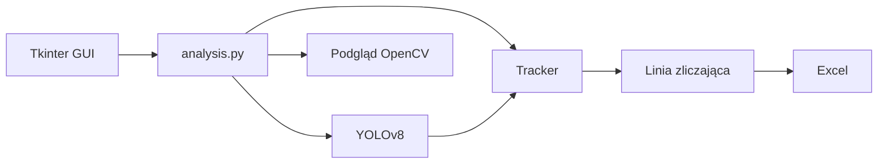

# Analiza natężenia ruchu drogowego

Aplikacja desktopowa do zliczania pojazdów na nagraniu lub strumieniu z kamery. Detekcja oparta jest o **YOLOv8**, śledzenie o własny tracker centroidowy, a zliczanie o wirtualną linię (poziomą lub pionową) z rozróżnieniem kierunku przejazdu. Wyniki można eksportować do **Excela** wraz z parametrami badania (model, rozdzielczość, FP16, czas inferencji).

**Stack:** Python 3.10+ · YOLOv8 (Ultralytics) · OpenCV · PyTorch (CPU/CUDA) · Tkinter · pandas

---

## Co robi aplikacja

- Wykrywa samochody, ciężarówki i motocykle (klasy COCO, model YOLOv8)
- Przypisuje obiektom stałe ID między klatkami (śledzenie po środkach ciężkości bboxów)
- Zlicza przejazdy przez linię w obu kierunkach (góra/dół albo lewo/prawo)
- Pracuje na pliku wideo albo kamerze
- Umożliwia porównanie wariantów modelu (`n` / `s` / `m`), rozdzielczości, progu *confidence* i trybu FP16
- Zapisuje zagregowane wyniki do `.xlsx` (liczniki + metryki inferencji)

## Architektura



| Moduł | Rola |
| --- | --- |
| `main.py` | Punkt wejścia, uruchamia okno konfiguracji |
| `gui.py` | Panel parametrów, wybór źródła, kolejka komunikatów, wątek analizy |
| `analysis.py` | Pętla wideo: inferencja, tracking, zliczanie, HUD, eksport |
| `tracker.py` | Matching detekcji między klatkami (odległość euklidesowa + timeout ID) |
| `model_handler.py` | Ładowanie wag YOLO na CPU albo GPU |
| `utils.py` | Lista klas COCO, zapis Excel, komunikaty błędów |

## Wymagania

- Python **3.10+**
- Opcjonalnie: GPU NVIDIA + CUDA, jeśli ma iść inferencja na karcie
- Tkinter (w standardzie Pythona; na Debian/Ubuntu: `python3-tk`)

## Instalacja

```bash
python -m venv .venv
# Windows:
.venv\Scripts\activate
# Linux / macOS:
# source .venv/bin/activate

pip install -r requirements.txt
```

`requirements.txt` wskazuje koła PyTorch z CUDA 12.1. Na samym CPU użyj oficjalnego indeksu CPU albo pomiń `cu121`.

Wagi YOLOv8 (`yolov8n.pt`, `yolov8s.pt`, `yolov8m.pt`) pobierają się automatycznie przy pierwszym uruchomieniu wybranego modelu.

## Uruchomienie

```bash
python main.py
```

1. Wybierz **CPU** albo **GPU** i zatwierdź urządzenie.
2. Ustaw model, rozdzielczość analizy, próg pewności i ewentualnie FP16.
3. Wybierz orientację linii, wpisz pozycję w pikselach i sprawdź ją przyciskiem podglądu.
4. Zaznacz klasy pojazdów i źródło (plik albo kamera).
5. **Display** — podgląd na żywo; **Record** — analiza i zapis `.xlsx`.
6. **Uruchom analizę.**

Skróty w oknie podglądu: **spacja** pauza, **Q** koniec.

## Parametry, które da się porównać

Aplikacja była projektowana pod pomiary, nie tylko pod jeden „gotowy” przebieg:

- wariant YOLOv8 (nano / small / medium)
- rozdzielczość wejścia sieci (wielokrotności 32)
- próg *confidence*
- inferencja FP16 na GPU
- pomijanie co N-tej klatki (kompromis szybkość / dokładność)

W eksporcie zapisują się m.in. liczba pojazdów w wybranym interwale czasowym (w tym niepełny ostatni odcinek) oraz przybliżone FPS inferencji.

## Struktura repozytorium

```
├── main.py
├── gui.py
├── analysis.py
├── tracker.py
├── model_handler.py
├── utils.py
├── coco.txt              # nazwy klas COCO
├── requirements.txt
└── main.spec             # PyInstaller (opcjonalny build .exe)
```
